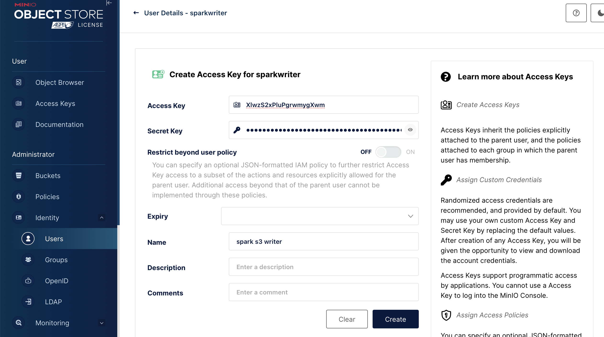

# Local Spark With MinIO S3 emulation

Spark with an S3 filesystem is a pretty common industry setup.  I wrote some notes down for how to create that environment locally for offline development.

I set this up for spark 3.4.3.

I avoided using docker, and focused instead on using programs I could start directly.  This avoids the vm overhead on my mac laptop.  The setup was extremely minimal so containers didn't feel like it would have added much benefit so far.


## Unpacking spark, adding hadoop-aws jars

First, download and unpack the tar from https://spark.apache.org/downloads.html

```sh
tar -xf ~/Downloads/spark-3.4.3-bin-hadoop3.tgz 
```

Make sure spark works:

```sh
$ cd spark-3.4.3-bin-hadoop3
$ ./bin/spark-shell
```

You should get a prompt:

```
Welcome to
      ____              __
     / __/__  ___ _____/ /__
    _\ \/ _ \/ _ `/ __/  '_/
   /___/ .__/\_,_/_/ /_/\_\   version 3.4.3
      /_/
         
Using Scala version 2.12.17 (OpenJDK 64-Bit Server VM, Java 11.0.23)
Type in expressions to have them evaluated.
Type :help for more information.

scala>
```

Initially I got bizarre failures (`Exception in thread "main" scala.reflect.internal.FatalError`, `java.lang.NoClassDefFoundError: Could not initialize class org.apache.spark.unsafe.array.ByteArrayMethods`), until I realized I was running java 21, which isn't supported.  I exported my JAVA_HOME to point to my 11 home (on macos `export JAVA_HOME=$(/usr/libexec/java_home -v 11)`), and that worked.

By looking at the jars directory, I found the hadoop version I needed to match (spark 3.4.3 seems to use hadoop 3.3.4)

```sh
$ ls jars/hadoop-client-api*
jars/hadoop-client-api-3.3.4.jar
```

Following the [Apache Spark AWS S3 Datasource](https://medium.com/@erkansirin/apache-spark-aws-s3-datasource-eb65ee906e64) post, I went about getting the hadoop-aws 3.3.4 jar


I manually compared the runtime and compile time deps from the artifact on [maven central](https://mvnrepository.com/artifact/org.apache.hadoop/hadoop-aws/3.3.4) with the ones alread in the `jars` dir of the spark installation and came up with this list.


```sh
$ cd jars

# actual dep
$ wget https://repo1.maven.org/maven2/org/apache/hadoop/hadoop-aws/3.3.4/hadoop-aws-3.3.4.jar

# compile dep
$ wget https://repo1.maven.org/maven2/com/amazonaws/aws-java-sdk-bundle/1.12.262/aws-java-sdk-bundle-1.12.262.jar

# note: the wildfly runtime dep is not needed, except when fs.s3a.connection.ssl.enabled is true, and fs.s3a.ssl.channel.mode is the non-default OpenSSL mode is set
```

there were no other transitive deps not accounted for already in the jars dir, so on to part 2.

## Downloading and setting up MinIO, a emulation of s3, configuring spark
I chose minio over localstack or other s3 emulators because it seemed pretty simple and self-contained, and didn't require docker (useful for saving precious ram on a laptop).  I followed
the basic [download and setup instructions](https://github.com/minio/minio?tab=readme-ov-file#gnulinux).

```sh
# create a spot for MinIO to write the s3 data / config metadata
$ cd <somewhere to put your s3 data>
$ mkdir s3_data


# -- linux -- 
$ wget https://dl.min.io/server/minio/release/linux-amd64/minio
$ chmod +x minio && mv minio /usr/local/bin
# -- macos --
$ brew install minio/stable/minio


$ minio server --address localhost:9000 s3_data

MinIO Object Storage Server
Copyright: 2015-2024 MinIO, Inc.
License: GNU AGPLv3 - https://www.gnu.org/licenses/agpl-3.0.html
Version: RELEASE.2024-07-04T14-25-45Z (go1.22.5 darwin/arm64)

API: http://localhost:9000
   RootUser: minioadmin 
   RootPass: minioadmin 

WebUI: http://10.13.38.58:54408 http://127.0.0.1:54408
   RootUser: minioadmin 
   RootPass: minioadmin 

CLI: https://min.io/docs/minio/linux/reference/minio-mc.html#quickstart
   $ mc alias set 'myminio' 'http://localhost:9000' 'minioadmin' 'minioadmin'

Docs: https://min.io/docs/minio/linux/index.html
Status:         1 Online, 0 Offline. 
STARTUP WARNINGS:
- Detected default credentials 'minioadmin:minioadmin', we recommend that you change these values with 'MINIO_ROOT_USER' and 'MINIO_ROOT_PASSWORD' environment variables
- The standard parity is set to 0. This can lead to data loss.
```

First I went to Buckets -> Create Bucket and created a bucket called "spark-data".


Then I went to Identity -> Users -> Create User and added a "sparkwriter" user (sparkwriter/sparkwriter) and then selected the user, then Service Accounts, and created an access key.

| Create User | Service Accounts | Add Access Key |
| ----------- | ---------------- | -------------- |
|  |    |  |

I copied the access key and secret key information into a spark-defaults.conf file, along with the endpoint info, back in my spark install:

```
# from the spark install:
$ cp conf/spark-defaults.conf.template conf/spark-defaults.conf
$ vim conf/spark-defaults.conf
```

I added these lines to `conf/spark-defaults.conf`:

```
# configure filesystem
spark.hadoop.fs.s3a.impl org.apache.hadoop.fs.s3a.S3AFileSystem
# use path-style access - you can change this, see: https://stackoverflow.com/a/59732437
spark.hadoop.fs.s3a.path.style.access true

# credentials from MinIO
spark.hadoop.fs.s3a.access.key XlwzS2xPluPgrwmygXwm
spark.hadoop.fs.s3a.secret.key JSEoXXXXXXXXXXXXXXXXXXXXX

# endpoint configuration (you can enable ssl, but more work)
spark.hadoop.fs.s3a.endpoint localhost:9000
spark.hadoop.fs.s3a.connection.ssl.enabled false
```

# Testing the configuration.

Finally, let's write some data.  With MinIO server still running, I reran spark-shell to pick up the new `spark-defaults` configuration.

```scala
$ bin/spark-shell

scala> val rdd = sc.parallelize(List("hi", "mom"))
rdd: org.apache.spark.rdd.RDD[String] = ParallelCollectionRDD[0] at parallelize at <console>:23

scala> rdd.saveAsTextFile("s3a://spark-data/out.txt")
24/07/09 12:19:20 WARN MetricsConfig: Cannot locate configuration: tried hadoop-metrics2-s3a-file-system.properties,hadoop-metrics2.properties
```

I could confirm the data was written via the MinIO console Object Browser as well:


| Object Explorer | Contents |
| --------------- | -------- |
|  |   |


I could also read it back:

```scala
scala> val rows = spark.read.text("s3a://spark-data/out.txt").collect
rows: Array[org.apache.spark.sql.Row] = Array([mom], [hi])
```

Pyspark works equally well:

```python
$ bin/pyspark
>>> spark.read.text("s3a://spark-data/out.txt").collect()
[Row(value='mom'), Row(value='hi')]
```


The local filesystem backing MinIO has the data as well (the on-disk format doesn't match exactly, the data and metadata is locked away in binary [x1meta](https://github.com/minio/minio/tree/master/docs/debugging) files)

```
[s3_data] $ ls spark-data/out.txt/
_SUCCESS	part-00001	part-00003	part-00005	part-00007
part-00000	part-00002	part-00004	part-00006
```


## Acknowlegedments / Sources
- [Configuration - Spark Docs](https://spark.apache.org/docs/latest/configuration.html)
- [S3A Configuration - Hadoop Docs](https://hadoop.apache.org/docs/current/hadoop-aws/tools/hadoop-aws/index.html)
- [Apache Spark AWS S3 Datasource](https://medium.com/@erkansirin/apache-spark-aws-s3-datasource-eb65ee906e64)
- [MinIO - github](https://github.com/minio/minio?tab=readme-ov-file#gnulinux)