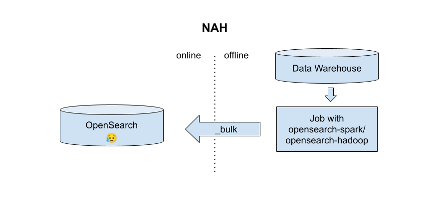

# Spark Loadable Opensearch Snapshots (PoC)

Instead of live-feeding documents from spark or hadoop in bulk, as the [opensearch-hadoop](https://github.com/opensearch-project/opensearch-hadoop) project does,  it would be nice to be able to directly create index snapshots as the output of an offline spark or hadoop job, then load the snapshots directly in a running opensearch cluster.


## Benefits of snapshots vs indexing


| Do This | Not This |
| ------- | -------- |
|  |   |


There are a few benefits to directly creating snapshots rather than writing to a live cluster:

- No need to size the online cluster according to the write throughput of the offline process
- Offline job reruns and speculative execution don't incur live traffic or create inconsistent state
- Offline job doesn't need network access or auth to another resource


## Running an embedded Opensearch Node via OpensearchRunner

To build a snapshot directly, the simplest strategy is to just run an in-memory (embedded) instance of opensearch,
so that each record is just transfered directly into a local, temporary index, before the snapshot is taken.

There is a perfect project for this, called [OpensearchRunner](https://github.com/codelibs/opensearch-runner).

From their documentation:

```java
import static org.codelibs.opensearch.runner.OpenSearchRunner.newConfigs;
...
// create runner instance
OpenSearchRunner runner = new OpenSearchRunner();
// create ES nodes
runner.onBuild(new OpenSearchRunner.Builder() {
    @Override
    public void build(final int number, final Builder settingsBuilder) {
        // put opensearch settings
        // settingsBuilder.put("index.number_of_replicas", 0);
    }
}).build(newConfigs());
```


In directly instantiates an Opensearch [Node](https://github.com/opensearch-project/OpenSearch/blob/main/server/src/main/java/org/opensearch/node/Node.java), with a configured port and set of plugins, directly in the running jvm, using whatever you already have on your classpath.


It works pretty similarly to how Nodes get instatiated in the clusters of Opensearch's own integration tests.  I added it as a dependency:

```xml
    <dependency>
      <groupId>org.codelibs.opensearch</groupId>
      <artifactId>opensearch-runner</artifactId>
      <version>2.15.0.0</version>
    </dependency>
```

I'm prototyping this using spark, and I have the maven shade plugin producing a uber jar (aka fat jar) for me, so the transitive dependencies of opensearch-runner, such as opensearch-server itself, are getting included in my spark job jar.  I had to shade a newer version of jackson in my jar to support methods of jackson used by opensearch that are newer than the ones included in spark's default runtime classpath (this was at least true for spark-3.4.3 and opensearch 2.15.0).

The natural place to instantiate this is a hadoop [RecordWriter](https://hadoop.apache.org/docs/current/api/org/apache/hadoop/mapreduce/RecordWriter.html) (itself created from a hadoop [OutputFormat](https://hadoop.apache.org/docs/current/api/org/apache/hadoop/mapreduce/OutputFormat.html)):


```java
public class OpenSearchOfflineRecordWriter extends RecordWriter<Integer, Row> {

    private OpenSearchRunner runner;

    public OpenSearchOfflineRecordWriter() {
        OpenSearchRunner.Configs runnerConfig = newConfigs()
                .numOfNode(1)
                .disableESLogger()
                .moduleTypes("org.opensearch.transport.Netty4Plugin");
        runner = new OpenSearchRunner();
        runner.onBuild(new OpenSearchRunner.Builder() {
            public void build(int index, Settings.Builder builder) {
                System.setProperty("opensearch.set.netty.runtime.available.processors", "false");
            }
        }).build(runnerConfig);
    }

    @Override
    public void write(Integer key, Row row) throws IOException, InterruptedException {
        Map<String, Object> data = new HashMap<>();
        IndexRequest indexRequest = new IndexRequest("test");

        // This is just dummy code for converting an object like
        //  a spark Row into a document
        for (int idx = 0; idx < row.schema().length(); idx++) {
            String fieldName = row.schema().apply(idx).name();
            if (fieldName.equals("_id")) {
                indexRequest.id(row.getString(idx));
            } else {
                data.put(fieldName, row.get(idx));
            }
        }

        indexRequest.source(data);
        try {
            // A network request! So... this is a lie?
            runner.node().client().index(indexRequest).get();
        } catch (ExecutionException e) {
            throw new RuntimeException("Failed to index", e);
        }
    }

    @Override
    public void close(TaskAttemptContext taskAttemptContext) throws  InterruptedException {
        try {
            try {
                // Refresh the index to flush
                System.out.println(runner.client().admin().indices().refresh(new RefreshRequest("test")).get());
            } catch (ExecutionException e) {
                throw new RuntimeException("Failed to flush", e);
            }
            runner.close();
        } catch (IOException e) {
            throw new RuntimeException("Failed to close", e);
        }
    }
}
```


The `write` function takes a record (for example a Row) and converts it to a document via an IndexRequest.
The line `runner.node().client().index(indexRequest).get()` is making a network request, but it's only to the local embedded Node.   I'm not aware of a more direct way unfortunately - even Opensearch's own tests use the same strategy. Perhaps there's a different transport plugin that has less overhead?

Since the request is synchronous, the record writing will happen at exactly the maximum speed of the indexing, and since the server is embedded in running process, everything is happenning locally in a given task without exerting pressure on another system.


## Taking a snapshot

The `OpenSearchOfflineRecordWriter` class can be expanded to support taking a snapshot of the index on `close()`.  In my proof of concept, I wanted to use the [s3 repository](https://opensearch.org/docs/latest/tuning-your-cluster/availability-and-recovery/snapshots/snapshot-restore/#take-snapshots) for storing snapshots, but any distributed storage should work fine.

I added the opensearch s3 reposity to the dependencies of my job jar:
```xml
    <dependency>
      <groupId>org.opensearch.plugin</groupId>
      <artifactId>repository-s3</artifactId>
      <version>2.15.0</version>
    </dependency>
```

I modified the OpenSearchRunner build arguments to include the s3 repository:

```java
    public OpenSearchOfflineRecordWriter() {
        OpenSearchRunner.Configs runnerConfig = newConfigs()
                .numOfNode(1)
                .disableESLogger()
                .moduleTypes("org.opensearch.transport.Netty4Plugin,org.opensearch.repositories.s3.S3RepositoryPlugin");
        runner = new OpenSearchRunner();
        runner.onBuild(new OpenSearchRunner.Builder() {
            public void build(int index, Settings.Builder builder) {
                // Avoid a CME
                System.setProperty("opensearch.set.netty.runtime.available.processors", "false");

                // Not necessary if you use IAM, and likely can pull values from your hadoop/spark env
                // Or potentially inject the hadoop/spark env's own, already configured aws sdk
                MockSecureSettings s = new MockSecureSettings();
                s.setString("s3.client.default.access_key", "XXX");
                s.setString("s3.client.default.secret_key", "YYY");

                // Usually no need to override these unless using an s3 emulator like MinIO
                builder.put("s3.client.default.endpoint", "http://localhost:9000");
                builder.put("s3.client.default.region", "us-east-2");
                builder.put("s3.client.default.protocol", "http");
                builder.put("s3.client.default.path_style_access", true);
                builder.setSecureSettings(s);
            }
        }).build(runnerConfig);
    }
```

In this case, I'm using a local s3 emulation - MinIO.  Normally you would not need to override the s3 endpoint and path style access.  I wrote up notes for [local spark and MinIO](/local_spark_s3).

Finally, `close()` needs to be modified to actually take the snapshot, using instructions from the [opensearch docs](https://opensearch.org/docs/latest/tuning-your-cluster/availability-and-recovery/snapshots/snapshot-restore/#take-snapshots):

```java
    public void close(TaskAttemptContext taskAttemptContext) throws  InterruptedException {
        try {
            try {
                // Refresh the index to flush
                System.out.println(runner.client().admin().indices().refresh(new RefreshRequest("test")).get());

                // TODO: maybe force merge?
                // https://opensearch.org/docs/latest/api-reference/index-apis/force-merge/

                // Take the snapshot

                // set an env var used by the s3 repository to avoid NPE
                System.setProperty("opensearch.path.conf", runner.node().getEnvironment().configFile().toString());
                
                // Create the repo
                PutRepositoryRequest putS3Repo = new PutRepositoryRequest("s3");
                putS3Repo.type("s3");
                putS3Repo.settings(Settings.builder()
                        .put("bucket", "spark-data")
                        .put("base_path", "snapshots")
                        .build()
                );

                System.out.println(runner.client().admin().cluster().putRepository(putS3Repo).get());
                
                // create the snapshot
                CreateSnapshotRequest createSnapshot = new CreateSnapshotRequest("s3", "snap");
                createSnapshot.waitForCompletion(true);
                System.out.println(runner.client().admin().cluster().createSnapshot(createSnapshot).get());

            } catch (ExecutionException e) {
                throw new RuntimeException("Failed to snapshot", e);
            }
            runner.close();
        } catch (IOException e) {
            throw new RuntimeException("Failed to close", e);
        }
    }
```

Finally, I tried out my new snapshotter:

```scala
   case class FD (_id: String, title: String, text: String)

    val dfRenamed = spark.createDataFrame(List(
      FD("id1", "title1", "text1"),
      FD("id2", "title2", "text2"),
      FD("id3", "title3", "text3"),
      FD("id4", "title4", "text4"),
    ))
    val partitioner = new RowDocumentPartitioner(1, dfRenamed.schema)
    val rdd = partitioner.toPairRDD(dfRenamed.rdd).partitionBy(partitioner)
    rdd.saveAsNewAPIHadoopFile[OpenSearchOfflineOutputFormat]("/tmp/foo")
```

And ran the job:

```
mvn package &&  ~/devel/spark-3.4.3-bin-hadoop3/bin/spark-submit target/spark-to-search-1.0-SNAPSHOT.jar

24/07/25 16:21:31 WARN NativeCodeLoader: Unable to load native-hadoop library for your platform... using builtin-java classes where applicable
24/07/25 16:21:31 INFO SparkContext: Running Spark version 3.4.3

[SNIP]

24/07/25 16:21:34 INFO ShuffleBlockFetcherIterator: Started 0 remote fetches in 3 ms
Cluster Name: opensearch-runner
Base Path:    /var/folders/wc/wrv1m1ks76s_xpz4rtktzz900000gn/T/opensearch-cluster14088571012420956979
Num Of Node:  1
Creating /var/folders/wc/wrv1m1ks76s_xpz4rtktzz900000gn/T/opensearch-cluster14088571012420956979/node_1
Creating /var/folders/wc/wrv1m1ks76s_xpz4rtktzz900000gn/T/opensearch-cluster14088571012420956979/node_1/config
Creating /var/folders/wc/wrv1m1ks76s_xpz4rtktzz900000gn/T/opensearch-cluster14088571012420956979/node_1/logs
Creating /var/folders/wc/wrv1m1ks76s_xpz4rtktzz900000gn/T/opensearch-cluster14088571012420956979/node_1/data
Node Name:      Node 1
HTTP Port:      9202
Data Directory: /var/folders/wc/wrv1m1ks76s_xpz4rtktzz900000gn/T/opensearch-cluster14088571012420956979/node_1/data
Log Directory:  /var/folders/wc/wrv1m1ks76s_xpz4rtktzz900000gn/T/opensearch-cluster14088571012420956979/node_1/logs
Creating /var/folders/wc/wrv1m1ks76s_xpz4rtktzz900000gn/T/opensearch-cluster14088571012420956979/node_1/modules
Creating /var/folders/wc/wrv1m1ks76s_xpz4rtktzz900000gn/T/opensearch-cluster14088571012420956979/node_1/plugins
24/07/25 16:21:34 INFO Node: version[2.15.0], pid[65284], build[unknown/unknown/unknown], OS[Mac OS X/14.5/aarch64], JVM[Amazon.com Inc./OpenJDK 64-Bit Server VM/11.0.23/11.0.23+9-LTS]
24/07/25 16:21:34 INFO Node: JVM home [/Users/johng/Library/Java/JavaVirtualMachines/corretto-11.0.23/Contents/Home]

[SNIP]

24/07/25 16:21:39 INFO RepositoriesService: put repository [s3]
org.opensearch.action.support.master.AcknowledgedResponse@4ee
24/07/25 16:21:39 INFO SnapshotsService: snapshot [s3:snap/vyjzOzHSRxGa0MXb7GtdIA] started
24/07/25 16:21:39 INFO SnapshotsService: snapshot [s3:snap/vyjzOzHSRxGa0MXb7GtdIA] completed with state [SUCCESS]
CreateSnapshotResponse{snapshotInfo=SnapshotInfo{snapshotId=snap/vyjzOzHSRxGa0MXb7GtdIA, state=SUCCESS, reason='null', indices=[test], startTime=1721938899610, endTime=1721938899610, totalShards=1, successfulShards=1, includeGlobalState=true, version=2.15.0, shardFailures=[], isRemoteStoreInteropEnabled=false}}
24/07/25 16:21:39 INFO Node: stopping ...
24/07/25 16:21:39 INFO Node: stopped
24/07/25 16:21:39 INFO Node: closing ...
24/07/25 16:21:39 INFO Node: closed
```

And the snapshot is up in s3:


## Loading the Snapshot into a Live Cluster

Creating an offline snapshot is only good it if can be truely loaded by a separate live cluster.  To test this, I went to my live cluster and added the spark-data s3 repository:

```sh
curl -XPUT "http://localhost:9200/_snapshot/my-s3-repository" -H 'Content-Type: application/json' -d'
{
  "type": "s3",
  "settings": {
    "bucket": "spark-data",
    "base_path": "snapshots"
  }
}'
```

I checked to see if the repo seemed valid, from the live cluster's perspective.  My snapshot was there:

```sh
$ curl -s http://localhost:9200/_snapshot/my-s3-repository/_all | jq .
{
  "snapshots": [
    {
      "snapshot": "snap",
      "uuid": "vyjzOzHSRxGa0MXb7GtdIA",
      "version_id": 136367827,
      "version": "2.15.0",
      "remote_store_index_shallow_copy": false,
      "indices": [
        "test"
      ],
      "data_streams": [],
      "include_global_state": true,
      "state": "SUCCESS",
      "start_time": "2024-07-25T20:21:39.610Z",
      "start_time_in_millis": 1721938899610,
      "end_time": "2024-07-25T20:21:39.610Z",
      "end_time_in_millis": 1721938899610,
      "duration_in_millis": 0,
      "failures": [],
      "shards": {
        "total": 1,
        "failed": 0,
        "successful": 1
      }
    }
  ]
}
```

I loaded the snapshot:

```sh
$ curl -XPOST http://localhost:9200/_snapshot/my-s3-repository/snap/_restore
{"accepted":true}
```

And searched:

```sh
$ curl localhost:9200/test/_search
{"took":29,"timed_out":false,"_shards":{"total":1,"successful":1,"skipped":0,"failed":0},"hits":{"total":{"value":4,"relation":"eq"},"max_score":1.0,"hits":[{"_index":"test","_id":"id1","_score":1.0,"_source":{"text":"text1","title":"title1"}},{"_index":"test","_id":"id2","_score":1.0,"_source":{"text":"text2","title":"title2"}},{"_index":"test","_id":"id3","_score":1.0,"_source":{"text":"text3","title":"title3"}},{"_index":"test","_id":"id4","_score":1.0,"_source":{"text":"text4","title":"title4"}}]}}
```

All of my data was present!


## Partitioning the offline data into shards

The basic concept seems to work.  The most obvious complication is sharding.  A snapshot-based approach is useful when there is lots of data to handle, and searching over that data would benefit from index sharding.

There are a few issues:

1. The data needs to be partitioned so that each task receives data for a specific shard
2. The snapshots of each shard need to produce a complete index snapshot

Ideally this is done without any coordination between embedded nodes on the offline (spark) side of things.
The basic idea that worked was to (1) leverage Opensearch's document router as a data Partitioner, (2) use a standalone embedded node per partition, snapshot them in independent repositories, then stitch the contents back together.


### 1. Splitting the data into Shards with a Partitioner

Opensearch and Elastic use a [hash-based document sharding algorithm](https://www.elastic.co/guide/en/elasticsearch/reference/current/mapping-routing-field.html).  By default, it uses the document's _id field to select a shard based on a hash, unless an alternative `routing` parameter is provided.

For Opensearch, the implementation is provided in [OperationRouting.java](https://github.com/opensearch-project/OpenSearch/blob/ffa67f9ad7b00739d7471166ba1f2cc5ec1ecbf5/server/src/main/java/org/opensearch/cluster/routing/OperationRouting.java#L444).


I made a class that used fake IndexMetadata to set the appropriate values for numberOfShards, and wrapped generateShardId.

```java
public class ShardPartitioner {
    private final IndexMetadata indexMetadata;

    public ShardPartitioner(int numShards) {
         indexMetadata = IndexMetadata.builder("foo")
                 .settings(Settings.builder().put(IndexMetadata.SETTING_VERSION_CREATED, Version.CURRENT))
                 .numberOfShards(numShards)
                 .numberOfReplicas(0)
                 .build();
    }

    Integer shardId(String id) {
        return OperationRouting.generateShardId(indexMetadata, id, null);
    }
}
```
I did this bit in java because I was having trouble getting spark's version of the scala compiler to recognize the java 21 annotations emitted by the Opensearch project.

I then created a partitioner implementation (and a toPairRDD helper function), that used the generateShardId wrapper:

```scala
class RowDocumentPartitioner(override val numPartitions: Int, schema: StructType) extends Partitioner {
  lazy val shardPartitioner = new ShardPartitioner(numPartitions)
  def toPairRDD(rdd: RDD[Row]): RDD[(Integer, Row)] = {
    rdd.keyBy(r => Integer.valueOf(shardPartitioner.shardId(r.getString(idFieldIndex))))
  }


  val idFieldIndex: Int = schema.view.zipWithIndex.find({ case (fld, idx) => fld.name == "_id" }) match {
    case Some((fld, idx)) => idx
    case _ => throw new RuntimeException(s"${schema} does not contain a _id field")
  }

  def getPartition(key: Any): Int = key match {
    case i: Integer => i
    case _ => throw new RuntimeException(s"Unexpected input type ${key.getClass.getName}")
  }
}
```

Finally, I wrapped partitioned my data, which I previewed above:

```scala
val partitioner = new RowDocumentPartitioner(8, dfRenamed.schema)
val rdd = partitioner.toPairRDD(dfRenamed.rdd).partitionBy(partitioner)
```


### 2. Generating a snapshot for each shard

Each RecordWriter handles a partition, so each RecordWriter can have its own embedded Opensearch node, and snapshot to an independent snapshot repo, named after the partition.

The first problem I encountered while running this in a local spark was that the nodes were running concurrently in the same jvm, and fighting over ports.  I adjusted my `runner.onBuild` setup to allocate different ports when needed:

```java
    private static final AtomicInteger basePortIncrement = new AtomicInteger(0);
    public OpenSearchOfflineRecordWriter() {
        OpenSearchRunner.Configs runnerConfig = newConfigs()
                .numOfNode(1)
                .disableESLogger()
                .moduleTypes("org.opensearch.transport.Netty4Plugin,org.opensearch.repositories.s3.S3RepositoryPlugin");
                // New:
                .baseHttpPort(9200 + basePortIncrement.getAndAdd(2))
```

The next problem was figuring out how to generate a "template" to layout the final snapshot, with as little mucking around with opensearch's snapshot logic as possible.

I decided I would make the 0th partition/shard the "master" template.  It would have a index configuration with the actual number of final shards (even though the 0th shard would be the only one with any data).  Every other data partition would have a node that just pretended it was a single-shard node.

I'd use `snapshots/$jobId/$indexName-$n` as my snapshot naming scheme, except that the 0th partition would be named `snapshots/$jobId/$indexName`.

When I saw the first record in a writer, I would know by the key what partition it was.  I added a new IndexCreate command that was called on the first record:

```java
    if (seenFirstRecord == false) {
        seenFirstRecord = true;
        int numShards = 1;
        if (partition == 0) {
            // the 0th partition should create all the shards for the other partitions
            // It will be the "main" snapshot that all other shards get copied into
            numShards = numPartitions;
        }
        CreateIndexResponse res = runner.node().client().admin().indices().prepareCreate(indexName())
                .setSettings(Settings.builder()
                    .put("index.number_of_replicas", 0)
                    .put("index.number_of_shards", numShards)
                    .put("index.number_of_routing_shards", numShards)
                    // No need to auto refresh
                    .put("index.refresh_interval", -1)
                    // No need for sync persistence
                    .put("index.translog.durability", "async")
                )
                .execute().get();
    }
```

A new variable `numPartitions` is passed along via hadoopConfiguration in spark, and then picked up via the `taskAttemptContext` in the `RecordWriter`.  Sadly, I didn't see any guaranteed pre-existing way of obtaining it.

For an example 2 partitions, here are the main generated output files:

```sh
# test-1 is an example of a non-0 partition snapshot.  These will only have an indices/$uuid/0 output.
s3a://spark-data/snapshots/$jobId/test-1/index-0
s3a://spark-data/snapshots/$jobId/test-1/index.latest
s3a://spark-data/snapshots/$jobId/test-1/meta-i-uuVCXAT2uY4IZf_3aR8g.dat
s3a://spark-data/snapshots/$jobId/test-1/snap-i-uuVCXAT2uY4IZf_3aR8g.dat
s3a://spark-data/snapshots/$jobId/test-1/indices/PGs7Yt2xRE6heSfMK5wQuA/meta-Rw-PBJEBideXThhvXogU.dat

s3a://spark-data/snapshots/$jobId/test-1/indices/PGs7Yt2xRE6heSfMK5wQuA/0/__IoPwetx6S9CaNMZTZUiq6g
s3a://spark-data/snapshots/$jobId/test-1/indices/PGs7Yt2xRE6heSfMK5wQuA/0/__XQTndreOSJaffRfJZ_maWw
s3a://spark-data/snapshots/$jobId/test-1/indices/PGs7Yt2xRE6heSfMK5wQuA/0/index-g5graGS3RHqKNrdvQ99EbA
s3a://spark-data/snapshots/$jobId/test-1/indices/PGs7Yt2xRE6heSfMK5wQuA/0/snap-i-uuVCXAT2uY4IZf_3aR8g.dat


# test is the 0th shard data, and the master template that all other shards will get copied to.
s3a://spark-data/snapshots/$jobId/test/index-0
s3a://spark-data/snapshots/$jobId/test/index.latest
s3a://spark-data/snapshots/$jobId/test/meta-aknfa-hgSPGoQ-eiQN0apw.dat
s3a://spark-data/snapshots/$jobId/test/snap-aknfa-hgSPGoQ-eiQN0apw.dat
s3a://spark-data/snapshots/$jobId/test/indices/1G5-Qwi1RKGP2RGNTs7cnQ/meta-SA-PBJEBideXThhvXog_.dat

s3a://spark-data/snapshots/$jobId/test/indices/1G5-Qwi1RKGP2RGNTs7cnQ/0/__e9PHXOvPSOupJemM7UISnQ
s3a://spark-data/snapshots/$jobId/test/indices/1G5-Qwi1RKGP2RGNTs7cnQ/0/__mPck2SuaT4-qFhra0-xo8Q
s3a://spark-data/snapshots/$jobId/test/indices/1G5-Qwi1RKGP2RGNTs7cnQ/0/index-bg7r7bKoQbWbsAMQnd8HUA
s3a://spark-data/snapshots/$jobId/test/indices/1G5-Qwi1RKGP2RGNTs7cnQ/0/snap-aknfa-hgSPGoQ-eiQN0apw.dat
# note it has vacous empty-shard data for the "1" partition (just index- and snap- metadata)
s3a://spark-data/snapshots/$jobId/test/indices/1G5-Qwi1RKGP2RGNTs7cnQ/1/index-VUj8o-1iRLCFtL0ZtuatYw
s3a://spark-data/snapshots/$jobId/test/indices/1G5-Qwi1RKGP2RGNTs7cnQ/1/snap-aknfa-hgSPGoQ-eiQN0apw.dat
```

After all snapshots have been taken, the contents needs to be moved from the $index-$n partition repositories into the template $index repositories for all 1 to $N partitions/shards, using the names produced by the master partition.

In this example the following moves need to be made:

- The index and snap files from the partitions are renamed according to the index uuid, shard number, snapshot uuid and index generation uuid of the template index.
- The `__` prefixed files, which are lucene compound index files (.cfe/.cfs) need their parent directories changed to the correct index uuid and shard number, but the file name does not change (it is referenced by name in the content of the index- and snap- metadata files)

```sh
mv s3a://spark-data/snapshots/$jobId/test-1/indices/PGs7Yt2xRE6heSfMK5wQuA/0/snap-i-uuVCXAT2uY4IZf_3aR8g.dat
   s3a://spark-data/snapshots/$jobId/test/indices/1G5-Qwi1RKGP2RGNTs7cnQ/1/snap-aknfa-hgSPGoQ-eiQN0apw.dat
mv s3a://spark-data/snapshots/$jobId/test-1/indices/PGs7Yt2xRE6heSfMK5wQuA/0/__XQTndreOSJaffRfJZ_maWw
   s3a://spark-data/snapshots/$jobId/test/indices/1G5-Qwi1RKGP2RGNTs7cnQ/1/__XQTndreOSJaffRfJZ_maWw
mv s3a://spark-data/snapshots/$jobId/test-1/indices/PGs7Yt2xRE6heSfMK5wQuA/0/__IoPwetx6S9CaNMZTZUiq6g
   s3a://spark-data/snapshots/$jobId/test/indices/1G5-Qwi1RKGP2RGNTs7cnQ/1/__IoPwetx6S9CaNMZTZUiq6g
mv s3a://spark-data/snapshots/$jobId/test-1/indices/PGs7Yt2xRE6heSfMK5wQuA/0/index-g5graGS3RHqKNrdvQ99EbA
   s3a://spark-data/snapshots/$jobId/test/indices/1G5-Qwi1RKGP2RGNTs7cnQ/1/index-VUj8o-1iRLCFtL0ZtuatYw
```

These moves are done in the `commitJob` step of the `OutputFormat`'s `OutputCommitter`, which runs after all shards have completed.


This produces the set of files that are expected by the snapshot.

I can test that the snapshot works back on the online cluster:

```sh
curl -XPUT "http://localhost:9200/_snapshot/my-s3-repository" -H 'Content-Type: application/json' -d'
{
  "type": "s3",
  "settings": {
    "bucket": "spark-data",
    "base_path": "snapshots/$jobId/test"
  }
}'
curl -XPOST http://localhost:9200/_snapshot/my-s3-repository/snap/_restore
{"accepted":true}

curl localhost:9200/test/_search
{"took":37,"timed_out":false,"_shards":{"total":2,"successful":2,"skipped":0,"failed":0},"hits":{"total":{"value":10000,"relation":"eq"},"max_score":1.0,"hits":[...]}}
```

A search shows 2 out of 2 shards were successful, and all 10000 entries I wrote were found.


## Building out the PoC

After proving out the concept there were a number of changes I wanted to make:
- I wanted to rely on the spark/hadoop cluster's s3 capabilities, instead of duplicating the s3 authorization, and configuring the OpenSearch s3 repo.  I switched to having the Opensearch write to a local fs repository during snapshot, and had the the hadoop FileSystem be in charge of ferrying the data to s3 (or hdfs, or elswhere).
- Having the 0 partition be in charge of the snaphot metadata felt a little silly. Instead I decided I'd create a template in the OutputCommiter before tasks started that all tasks (the individual shards) would be in charge of overwriting.
- Hadoop and Spark use different serialization strategies, and I wanted a system that worked well for both.  I created an independent subproject for the main hadoop libraries that worked in hadoop-native types, and subclassed version for spark with spark's native types.

The project is up on github: [opensearch-hadoop-snapshotwriter](https://github.com/slackhappy/opensearch-hadoop-snapshotwriter).